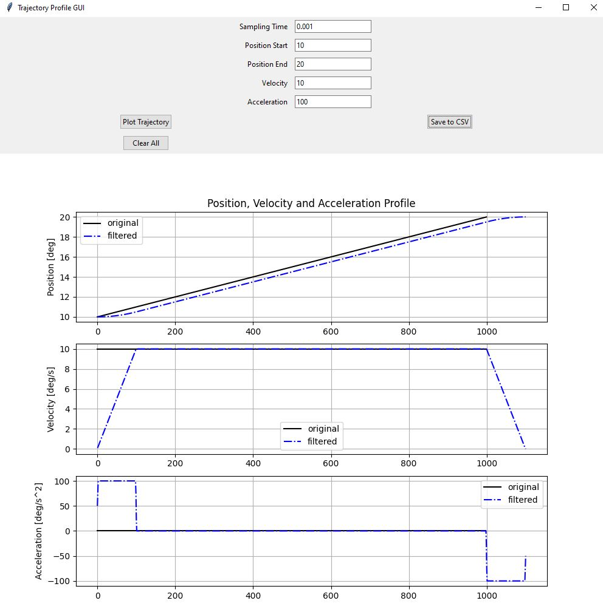

# trajectory_generation
## Description

This project is a for generating trajectory profiles. It allows users to input parameters such as sampling time, start and end positions, velocity, and acceleration, and visualize the resulting trajectory profiles. The GUI also provides options to save the generated trajectory data to a CSV file.

## Installation

1. Clone the repository to your local machine:
```
git clone git@github.com:parsa25b/trajectory_generation.git
```

2. Install the required dependencies:
```
pip install -r requirements.txt
```
## Usage
3. Run the GUI application:
```
python src/trajectory_gui.py
```

4. Enter the desired parameters in the input fields and click the "Plot Trajectory" button to generate and visualize the trajectory profiles.

5. Optionally, click the "Save to CSV" button to save the trajectory data to a CSV file.

## Screenshots



## Contributing

Contributions are welcome! Please follow these steps to contribute:
1. Fork the repository
2. Create a new branch 
```git checkout -b feature/your-feature```)
3. Make your changes
4. Commit your changes 
```git commit -am 'Add some feature'```
5. Push to the branch 
```git push origin feature/your-feature```
6. Create a new Pull Request

## License
This project is licensed under the [MIT License](LICENSE).
